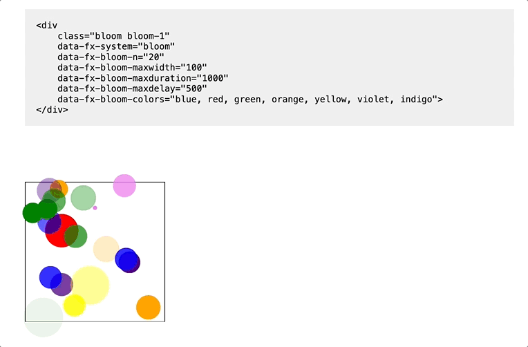

# HTML5 Canvas FX

This library contains the code for the visual effects used for my Halloween story, [THE LAST REUNION SHOW](https://neathobby.com/special/the-last-reunion-show/). The effects are done with `<canvas>` HTML elements overlaid on top of the images.



## Unmaintained

This code still works but is no longer being developed.

(These were also created long before [web components](https://developer.mozilla.org/en-US/docs/Web/API/Web_components) were a viable thing.)

## Installation

To add the library to your webpage, copy the `dist` folder over to where your webpage is, then add the following `<script>` element at the bottom of your page, right before the closing `</body>` element:

```
<script type="text/javascript" src="./dist/main.js"></script>
```

## Using the library

See the [demos](demos) for usage examples.
